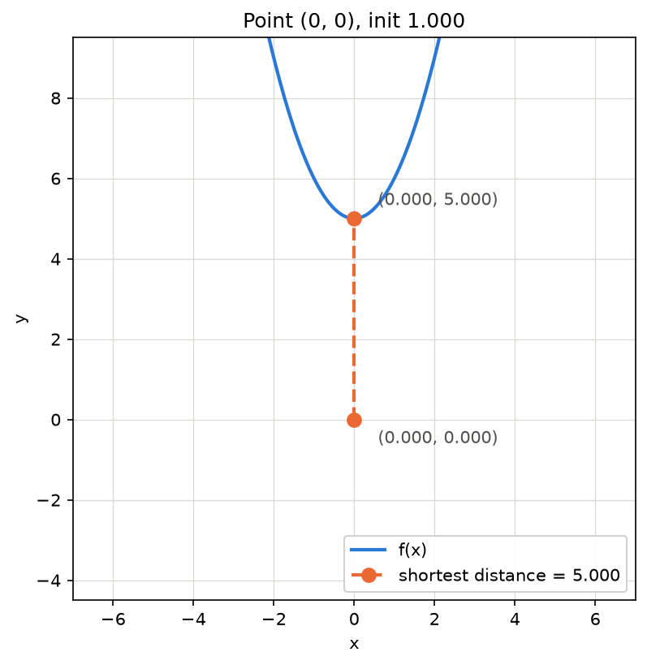
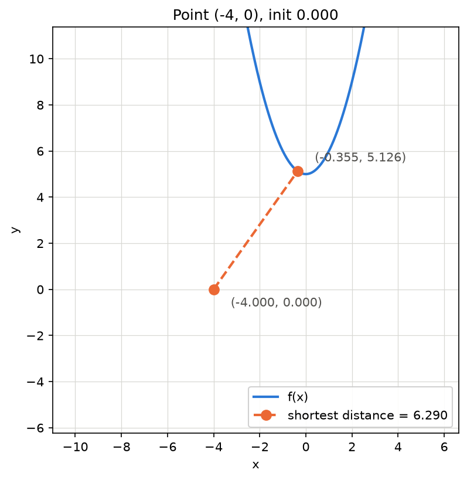
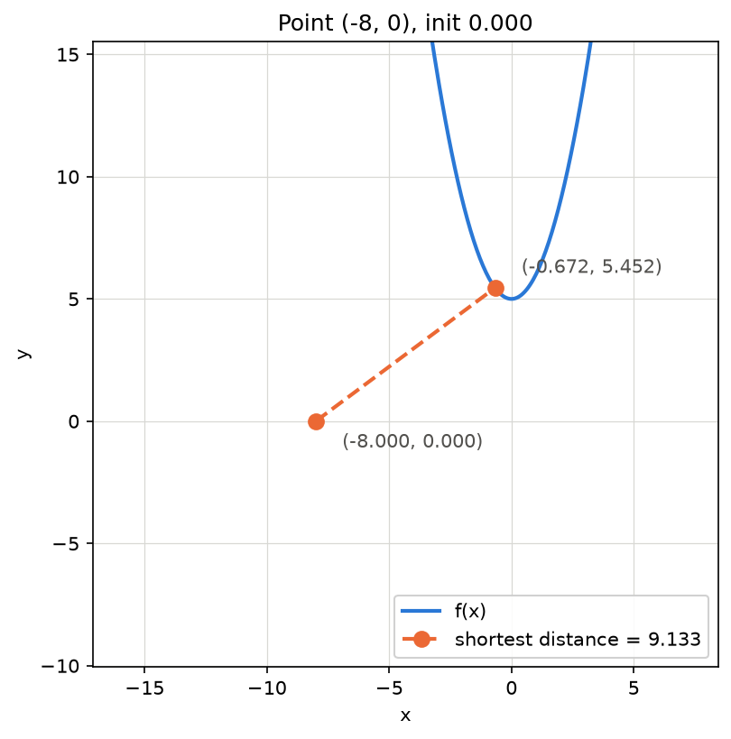
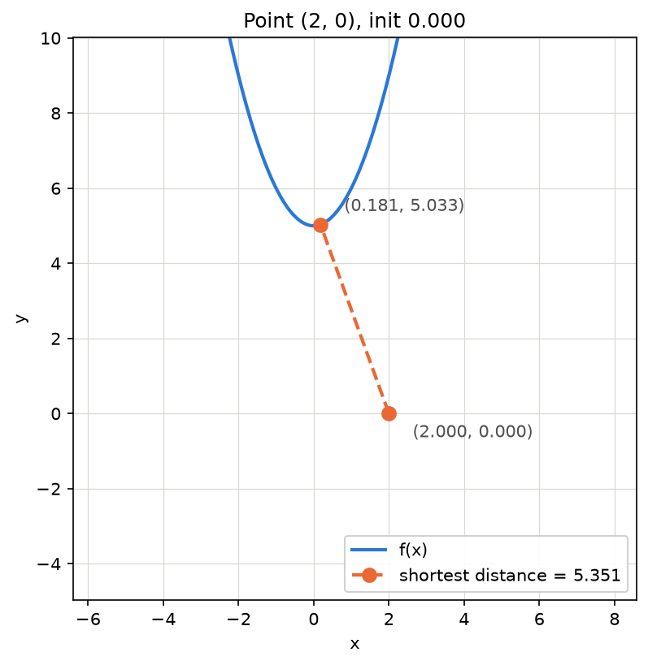
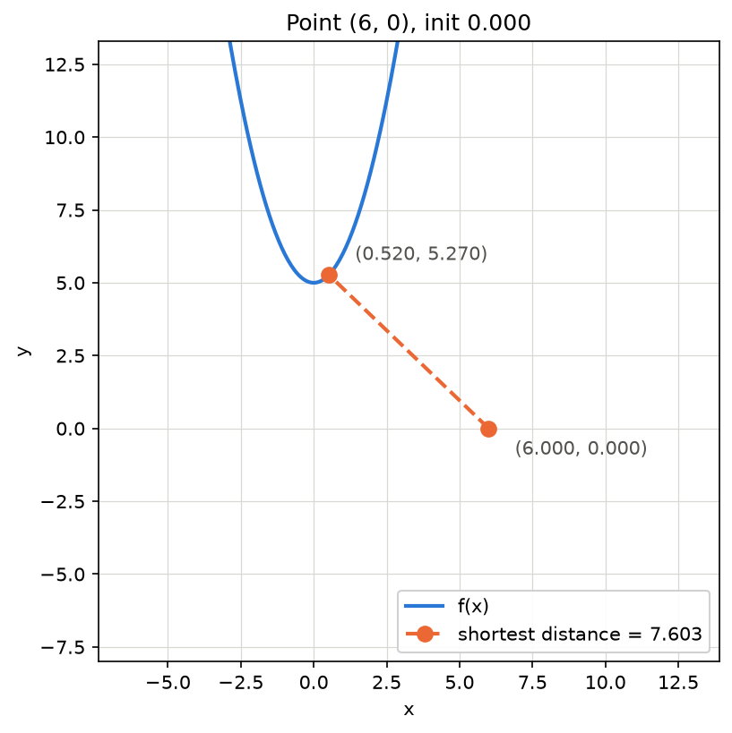

# Assignment 1

> Author: Yuchen Lin
> Date: 2026-09-29

## Part 1:

**Objective: Find shortest distance from a point
to a function.**

Equation: $f(x) = x^2 + 5$

Objective Function:

$$
d = \sqrt{(x - x_0)^2 + \left(f(x) - y_0\right)^2} \tag{1}
$$

Since the objective are monotonically increasing,
we can simplify the computation to $D = (x-x_0)^2
+(f(x)-y_0)^2$

### Method 1: Analytical Approach 

Step 1: compute the derivative W.R.T the distance
function.

$$
D = (x-x_0)^2+\left[(x^2+5)-y_0\right]^2 \tag{1}\label{eq:objective}
$$

$$
\begin{align}
  \frac{dD}{dx} &= 2(x-x_0) + 2\left[(x^2+5)-y_0\right]\times (2x) \\
                &= 2(x-x_0) + 4x(x^2 + 5 - y_0) \tag{2}\label{eq:first_order}
\end{align}
$$

Step 2: Substitute point of interested and set $\frac{dD}{dx}=0$

$$
(x_0, y_0) = (0, 0) \tag{3}\label{eq:init_point}
$$

Substitute eq. $$\eqref{eq:init_point}$$ into eq. $$\eqref{eq:first_order}$$:

$$
\begin{align}
  0 &= 2x + 4x\left[x^2 + 5\right] \\
    &= 4x^3 + 22x \\
    &= 2x(2x^2+11) \tag{4}\label{eq:soln_a}
\end{align}
$$

According to eq. $$\eqref{eq:soln_a}$$, there are two possible
solutions for the given equation: $2x=0$ or $2x^2+11=0$.

Since $2x^2+11>0 \quad \forall x \in \mathbb{R}$, the second
factor has no real root, so $$x=0$$ is the only critical point.
The closest point on the curve is therefore
$$\left(0, f(0)\right) = (0, 5)$$, at a distance of $$d=5$$.

The rest of the solution will be listed in table form and hand
calculation will be found in appendix A.

| Point $$(x_0, y_0)$$ | Critical eq. $$D'(x)=0$$ | Closest $$x^*$$ | Closest point | Distance $$d$$ |
| :--- | :--- | ---: | :---: | ---: |
| $$(0, 0)$$  | $$4x^3 + 22x = 0$$      | $$0.0000$$  | $$(0.0000,\ 5.0000)$$  | $$5.0000$$ |
| $$(-4, 0)$$ | $$4x^3 + 22x + 8 = 0$$  | $$-0.3555$$ | $$(-0.3555,\ 5.1264)$$ | $$6.2898$$ |
| $$(-8, 0)$$ | $$4x^3 + 22x + 16 = 0$$ | $$-0.6721$$ | $$(-0.6721,\ 5.4517)$$ | $$9.1334$$ |
| $$(2, 0)$$  | $$4x^3 + 22x - 4 = 0$$  | $$0.1807$$  | $$(0.1807,\ 5.0327)$$  | $$5.3514$$ |
| $$(6, 0)$$  | $$4x^3 + 22x - 12 = 0$$ | $$0.5199$$  | $$(0.5199,\ 5.2703)$$  | $$7.6031$$ |

Each cubic has exactly one real root, so the critical point is
unique in every case and no comparison between candidates is
needed.

## Method 2: Newton-Raphson Method

Newton-Raphson method require both first order derivative and
second order derivative. The original and the first order of
the objective function is available at eq. \ref{eq:objective},
eq. \ref{eq:first_order}.

$$
\begin{align}
  \frac{d^2D}{dx^2} &= 2 + 12x^2 + 20 -4y_0 \\
                    &= 12x^2 + 22 - 4y_0 \tag{5}\label{eq:second_order}
\end{align}
$$

For point $(0, 0)$, our initial guess start at $x=1$. We
will demonstrate solving it manually by following the
algorithm for two iteration and demonstrate the final
solution.

**First Iteration**

First Order at $x=1$:

$$
D'(1) = 4+ 22 = 26
$$

Second Order at $x=1$:

$$
D"(1) = 12 + 22 = 34
$$

Update the next guess:

$$
\begin{align}
  x &= 1 - \frac{D'(1)}{D"(1)} \\
    &= \frac{4}{17}
\end{align}
$$

**Second Iteration(Using New Guess from Prev iteration)**

First Order Derivative:

$$
D'(\frac{4}{17}) = 5.229
$$

Second Order Derivative:

$$
D"(\frac{4}{17}) = 22.664
$$

Update the next Guess:

$$
\begin{align}
  x &= \frac{4}{17} - \frac{D'(\frac{4}{17})}{D"(\frac{4}{17})} \\
    &= 4.598 \times 10^{-3}
\end{align}
$$

Using the result from the second iteration, we could compute
the shortest from the point to the function.

$$
d(4.598 \times 10^{-3}) \approx 5.00002326
$$

Compute three iteration for all the points and the results are
summarized below.

**Point $$(0, 0)$$, initial guess $$x=1$$**

| Iteration | $$x$$ | $$D'(x)$$ | $$D''(x)$$ | Distance $$d(x)$$ |
| :--- | ---: | ---: | ---: | ---: |
| First | $$1.000$$ | $$26.000$$ | $$34.000$$ | $$6.083$$ |
| Second | $$0.235$$ | $$5.229$$ | $$22.664$$ | $$5.061$$ |
| Third | $$0.005$$ | $$0.101$$ | $$22.000$$ | $$5.000$$ |

**Point $$(-4, 0)$$, initial guess $$x=0$$**

| Iteration | $$x$$ | $$D'(x)$$ | $$D''(x)$$ | Distance $$d(x)$$ |
| :--- | ---: | ---: | ---: | ---: |
| First | $$0.000$$ | $$8.000$$ | $$22.000$$ | $$6.403$$ |
| Second | $$-0.364$$ | $$-0.192$$ | $$23.587$$ | $$6.290$$ |
| Third | $$-0.355$$ | $$0.000$$ | $$23.516$$ | $$6.290$$ |

**Point $$(-8, 0)$$, initial guess $$x=0$$**

| Iteration | $$x$$ | $$D'(x)$$ | $$D''(x)$$ | Distance $$d(x)$$ |
| :--- | ---: | ---: | ---: | ---: |
| First | $$0.000$$ | $$16.000$$ | $$22.000$$ | $$9.434$$ |
| Second | $$-0.727$$ | $$-1.539$$ | $$28.347$$ | $$9.136$$ |
| Third | $$-0.673$$ | $$-0.025$$ | $$27.435$$ | $$9.133$$ |

**Point $$(2, 0)$$, initial guess $$x=0$$**

| Iteration | $$x$$ | $$D'(x)$$ | $$D''(x)$$ | Distance $$d(x)$$ |
| :--- | ---: | ---: | ---: | ---: |
| First | $$0.000$$ | $$-4.000$$ | $$22.000$$ | $$5.385$$ |
| Second | $$0.182$$ | $$0.024$$ | $$22.397$$ | $$5.351$$ |
| Third | $$0.181$$ | $$0.000$$ | $$22.392$$ | $$5.351$$ |

**Point $$(6, 0)$$, initial guess $$x=0$$**

| Iteration | $$x$$ | $$D'(x)$$ | $$D''(x)$$ | Distance $$d(x)$$ |
| :--- | ---: | ---: | ---: | ---: |
| First | $$0.000$$ | $$-12.000$$ | $$22.000$$ | $$7.810$$ |
| Second | $$0.545$$ | $$0.649$$ | $$25.570$$ | $$7.604$$ |
| Third | $$0.520$$ | $$0.004$$ | $$25.246$$ | $$7.603$$ |

### Converging Results from Python Script

A Python script iterates the algorithm to convergence, stopping
once the step size falls below a tolerance of $$10^{-7}$$.

| Point $$(x_0, y_0)$$ | Best $$x^*$$ | Closest point | Distance $$d$$ |
| :--- | ---: | :---: | ---: |
| $$(0, 0)$$  | $$0.0000$$  | $$(0.0000,\ 5.0000)$$  | $$5.0000$$ |
| $$(-4, 0)$$ | $$-0.3555$$ | $$(-0.3555,\ 5.1264)$$ | $$6.2898$$ |
| $$(-8, 0)$$ | $$-0.6721$$ | $$(-0.6721,\ 5.4517)$$ | $$9.1334$$ |
| $$(2, 0)$$  | $$0.1807$$  | $$(0.1807,\ 5.0327)$$  | $$5.3514$$ |
| $$(6, 0)$$  | $$0.5199$$  | $$(0.5199,\ 5.2703)$$  | $$7.6031$$ |



*Point $$(0,0)$$ — closest point $$(0.0000,\ 5.0000)$$, $$d=5.0000$$.*



*Point $$(-4,0)$$ — closest point $$(-0.3555,\ 5.1264)$$, $$d=6.2898$$.*



*Point $$(-8,0)$$ — closest point $$(-0.6721,\ 5.4517)$$, $$d=9.1334$$.*



*Point $$(2,0)$$ — closest point $$(0.1807,\ 5.0327)$$, $$d=5.3514$$.*



*Point $$(6,0)$$ — closest point $$(0.5199,\ 5.2703)$$, $$d=7.6031$$.*

The complete implementation is listed below, and is also
available on
[GitHub](https://github.com/billylin609/billylin609.github.io/blob/main/SYDE572/assignment1/part1.py).

```python
import numpy as np
import matplotlib.pyplot as plt
from typing import Callable
from pathlib import Path

# Represent the equation
def newton_polynomial(x0, y0, f, df, ddf,
    initial_guess=0.0, tolerance=1e-7, max_iter=100):
  '''
  Newton-Raphson Method to Approx. shortest distance
  from a point to a function.

  Minimizes the squared distance
  D(x) = (x - x0)^2 + (f(x) - y0)^2
  by driving D'(x) to zero.

  @Input:
  x0: float the x coordinate of the point
  y0: float the y coordinate of the point
  f: lambda
  df: lambda first order derivative
  ddf: lambda second order derivative.
  initial_guess: float the starting x for the iteration
  tolerance: float stop once the step is smaller than this

  @return:
  x: the closest point
  '''
  print(f'\nPoint: ({x0:.3f}, {y0:.3f}), Initial Guess: {initial_guess:.3f}')
  x = initial_guess
  for i in range(max_iter):
    if i < 5:
      verbose = True
    else:
      verbose = False
    next_x = newton_step(x0, y0, f(x), df(x), ddf(x),
                x, verbose)
    converged = abs(next_x - x) < tolerance
    x = next_x
    print(f'Epoch: {i}, x: {x}, Distance: {distance(x, x0, f(x), y0):.3f}')
    if converged:
      break
  return x

def newton_step(x0, y0, f, df, ddf, x,
    verbose=False):
  D_prime = 2*(x-x0) + 2 * (f-y0)*df
  D_double_prime = 2 + 2*(df**2) + 2*(f-y0)*ddf
  next_x = x - D_prime/D_double_prime
  if verbose == True:
    print(f'Guess:{x:.5f}, D\'{D_prime:.3f}, D\'\'{D_double_prime:.3f}, '
          f'Next_Guess:{next_x:.3f}')
  return next_x

def distance(x, x0, f, y0):
  '''
  Compute the shortest distance from a function to a point
  '''
  return np.sqrt((x-x0)**2+(f-y0)**2)

def plot(x: float, x0: float, f: Callable, y0: float, method: str, start: str):
  '''
  Plot the curve, the query point, and the segment joining them.

  @Input:
  x: float the closest point on the curve, from newton_polynomial
  x0: float the x coordinate of the point
  f: callable the function that was minimised against
  y0: float the y coordinate of the point
  method: str the method folder the figure is saved under, e.g. 'method1'
  start: str the starting condition, e.g. 'init_1.000', used in the name
  '''
  d = distance(x, x0, f(x), y0)

  # frame a square window around both points, so equal aspect stays readable
  half = max(d * 1.4, 2.5)   # keep enough curve in frame when d is tiny
  cx, cy = (x0 + x) / 2, (y0 + f(x)) / 2
  xs = np.linspace(cx - half, cx + half, 400)

  fig, ax = plt.subplots(figsize=(6, 6))
  ax.plot(xs, f(xs), color='#2a78d6', linewidth=2, label='f(x)')
  ax.plot([x0, x], [y0, f(x)], color='#eb6834', linewidth=2, linestyle='--',
          marker='o', markersize=8, label=f'shortest distance = {d:.3f}')
  ax.annotate(f'({x0:.3f}, {y0:.3f})', (x0, y0),
              textcoords='offset points', xytext=(14, -14), color='#52514e')
  ax.annotate(f'({x:.3f}, {f(x):.3f})', (x, f(x)),
              textcoords='offset points', xytext=(14, 8), color='#52514e')

  ax.set_xlim(cx - half, cx + half)
  ax.set_ylim(cy - half, cy + half)
  ax.set_aspect('equal')
  ax.grid(True, color='#d8d8d4', linewidth=0.6)
  ax.set_axisbelow(True)
  ax.set_xlabel('x')
  ax.set_ylabel('y')
  ax.set_title(f'Point ({x0:g}, {y0:g}), {start.replace("_", " ")}')
  ax.legend(loc='lower right', framealpha=0.9)

  out_dir = Path(__file__).parent / method
  out_dir.mkdir(exist_ok=True)
  out = out_dir / f'fig_point_{x0:.3f}_{y0:.3f}_{start}.png'
  fig.savefig(out, dpi=150, bbox_inches='tight')
  plt.close(fig)
  print(f'Saved {out}')

if __name__ == '__main__':
  f = lambda x: x**2+5

  points = ((0, 0), (-4, 0), (-8, 0), (2, 0), (6, 0))
  initial_guesses = (1, 0, 0, 0, 0)

  for (x0, y0), initial_guess in zip(points, initial_guesses):
    print(f'\n\n Points: ({x0}, {y0})')
    closest_x = newton_polynomial(x0=x0, y0=y0,
                      f=f,
                      df=lambda x: 2*x,
                      ddf=lambda x: 2*(x**0),
                      initial_guess=initial_guess)
    print(f'Summary: Best x: {closest_x:.4f}, '
          f'Distance: {distance(closest_x, x0, f(closest_x), y0):.4f}')
    plot(closest_x, x0, f, y0, 'method1', f'init_{initial_guess:.3f}')
```
