# Assignment 1

> Author: Yuchen Lin \\
> Date: 2026-09-29

## Part 1:

**Objective: Find shortest distance from a point
to a function.**

Equation: $f(x) = x^2 + 5$

Objective Function:

$$
d = \sqrt{(x - x_0)^2 + \left(f(x) - y_0\right)^2} \tag{1}
$$

Since the objective are monotonically increasing,
we can simplify the computation to $D = (x-x_0)^2
+(f(x)-y_0)^2$

### Method 1: Analytical Approach 

Step 1: compute the derivative W.R.T the distance
function.

$$
D = (x-x_0)^2+\left[(x^2+5)-y_0\right]^2 \tag{1}\label{eq:objective}
$$

$$
\begin{align}
  \frac{dD}{dx} &= 2(x-x_0) + 2\left[(x^2+5)-y_0\right]\times (2x) \\
                &= 2(x-x_0) + 4x(x^2 + 5 - y_0) \tag{2}\label{eq:first_order}
\end{align}
$$

Step 2: Substitute point of interested and set $\frac{dD}{dx}=0$

$$
(x_0, y_0) = (0, 0) \tag{3}\label{eq:init_point}
$$

Substitute eq. $$\eqref{eq:init_point}$$ into eq. $$\eqref{eq:first_order}$$:

$$
\begin{align}
  0 &= 2x + 4x\left[x^2 + 5\right] \\
    &= 4x^3 + 22x \\
    &= 2x(2x^2+11) \tag{4}\label{eq:soln_a}
\end{align}
$$

According to eq. $$\eqref{eq:soln_a}$$, there are two possible
solutions for the given equation: $2x=0$ or $2x^2+11=0$.

Since $2x^2+11>0 \quad \forall x \in \mathbb{R}$, the second
factor has no real root, so $$x=0$$ is the only critical point.
The closest point on the curve is therefore
$$\left(0, f(0)\right) = (0, 5)$$, at a distance of $$d=5$$.

The rest of the solution will be listed in table form and hand
calculation will be found in appendix A.

| Point $$(x_0, y_0)$$ | Critical eq. $$D'(x)=0$$ | Closest $$x^*$$ | Closest point | Distance $$d$$ |
| :--- | :--- | ---: | :---: | ---: |
| $$(0, 0)$$  | $$4x^3 + 22x = 0$$      | $$0.0000$$  | $$(0.0000,\ 5.0000)$$  | $$5.0000$$ |
| $$(-4, 0)$$ | $$4x^3 + 22x + 8 = 0$$  | $$-0.3555$$ | $$(-0.3555,\ 5.1264)$$ | $$6.2898$$ |
| $$(-8, 0)$$ | $$4x^3 + 22x + 16 = 0$$ | $$-0.6721$$ | $$(-0.6721,\ 5.4517)$$ | $$9.1334$$ |
| $$(2, 0)$$  | $$4x^3 + 22x - 4 = 0$$  | $$0.1807$$  | $$(0.1807,\ 5.0327)$$  | $$5.3514$$ |
| $$(6, 0)$$  | $$4x^3 + 22x - 12 = 0$$ | $$0.5199$$  | $$(0.5199,\ 5.2703)$$  | $$7.6031$$ |

Each cubic has exactly one real root, so the critical point is
unique in every case and no comparison between candidates is
needed.

### Method 2: Newton-Raphson Method

Newton-Raphson method require both first order derivative and
second order derivative. The original and the first order of
the objective function is available at eq. \ref{eq:objective},
eq. \ref{eq:first_order}.

$$
\begin{align}
  \frac{d^2D}{dx^2} &= 2 + 12x^2 + 20 -4y_0 \\
                    &= 12x^2 + 22 - 4y_0 \tag{5}\label{eq:second_order}
\end{align}
$$

For point $(0, 0)$, our initial guess start at $x=1$. We
will demonstrate solving it manually by following the
algorithm for two iteration and demonstrate the final
solution.

**First Iteration**

First Order at $x=1$:

$$
D'(1) = 4+ 22 = 26
$$

Second Order at $x=1$:

$$
D"(1) = 12 + 22 = 34
$$

Update the next guess:

$$
\begin{align}
  x &= 1 - \frac{D'(1)}{D''(1)} \\
    &= \frac{4}{17}
\end{align}
$$

**Second Iteration(Using New Guess from Prev iteration)**

First Order Derivative:

$$
D'(\frac{4}{17}) = 5.229
$$

Second Order Derivative:

$$
D"(\frac{4}{17}) = 22.664
$$

Update the next Guess:

$$
\begin{align}
  x &= \frac{4}{17} - \frac{D'(\frac{4}{17})}{D''(\frac{4}{17})} \\
    &= 4.598 \times 10^{-3}
\end{align}
$$

Using the result from the second iteration, we could compute
the shortest from the point to the function.

$$
d(4.598 \times 10^{-3}) \approx 5.00002326
$$

Compute three iteration for all the points and the results are
summarized below.

**Point $$(0, 0)$$, initial guess $$x=1$$**

| Iteration | $$x$$ | $$D'(x)$$ | $$D''(x)$$ | Distance $$d(x)$$ |
| :--- | ---: | ---: | ---: | ---: |
| First | $$1.000$$ | $$26.000$$ | $$34.000$$ | $$6.083$$ |
| Second | $$0.235$$ | $$5.229$$ | $$22.664$$ | $$5.061$$ |
| Third | $$0.005$$ | $$0.101$$ | $$22.000$$ | $$5.000$$ |

**Point $$(-4, 0)$$, initial guess $$x=0$$**

| Iteration | $$x$$ | $$D'(x)$$ | $$D''(x)$$ | Distance $$d(x)$$ |
| :--- | ---: | ---: | ---: | ---: |
| First | $$0.000$$ | $$8.000$$ | $$22.000$$ | $$6.403$$ |
| Second | $$-0.364$$ | $$-0.192$$ | $$23.587$$ | $$6.290$$ |
| Third | $$-0.355$$ | $$0.000$$ | $$23.516$$ | $$6.290$$ |

**Point $$(-8, 0)$$, initial guess $$x=0$$**

| Iteration | $$x$$ | $$D'(x)$$ | $$D''(x)$$ | Distance $$d(x)$$ |
| :--- | ---: | ---: | ---: | ---: |
| First | $$0.000$$ | $$16.000$$ | $$22.000$$ | $$9.434$$ |
| Second | $$-0.727$$ | $$-1.539$$ | $$28.347$$ | $$9.136$$ |
| Third | $$-0.673$$ | $$-0.025$$ | $$27.435$$ | $$9.133$$ |

**Point $$(2, 0)$$, initial guess $$x=0$$**

| Iteration | $$x$$ | $$D'(x)$$ | $$D''(x)$$ | Distance $$d(x)$$ |
| :--- | ---: | ---: | ---: | ---: |
| First | $$0.000$$ | $$-4.000$$ | $$22.000$$ | $$5.385$$ |
| Second | $$0.182$$ | $$0.024$$ | $$22.397$$ | $$5.351$$ |
| Third | $$0.181$$ | $$0.000$$ | $$22.392$$ | $$5.351$$ |

**Point $$(6, 0)$$, initial guess $$x=0$$**

| Iteration | $$x$$ | $$D'(x)$$ | $$D''(x)$$ | Distance $$d(x)$$ |
| :--- | ---: | ---: | ---: | ---: |
| First | $$0.000$$ | $$-12.000$$ | $$22.000$$ | $$7.810$$ |
| Second | $$0.545$$ | $$0.649$$ | $$25.570$$ | $$7.604$$ |
| Third | $$0.520$$ | $$0.004$$ | $$25.246$$ | $$7.603$$ |

#### Converging Results from Python Script

A Python script iterates the algorithm to convergence, stopping
once the step size falls below a tolerance of $$10^{-7}$$.

| Point $$(x_0, y_0)$$ | Best $$x^*$$ | Closest point | Distance $$d$$ |
| :--- | ---: | :---: | ---: |
| $$(0, 0)$$  | $$0.0000$$  | $$(0.0000,\ 5.0000)$$  | $$5.0000$$ |
| $$(-4, 0)$$ | $$-0.3555$$ | $$(-0.3555,\ 5.1264)$$ | $$6.2898$$ |
| $$(-8, 0)$$ | $$-0.6721$$ | $$(-0.6721,\ 5.4517)$$ | $$9.1334$$ |
| $$(2, 0)$$  | $$0.1807$$  | $$(0.1807,\ 5.0327)$$  | $$5.3514$$ |
| $$(6, 0)$$  | $$0.5199$$  | $$(0.5199,\ 5.2703)$$  | $$7.6031$$ |


*Point $$(0,0)$$ — closest point $$(0.0000,\ 5.0000)$$, $$d=5.0000$$.*


*Point $$(-4,0)$$ — closest point $$(-0.3555,\ 5.1264)$$, $$d=6.2898$$.*


*Point $$(-8,0)$$ — closest point $$(-0.6721,\ 5.4517)$$, $$d=9.1334$$.*


*Point $$(2,0)$$ — closest point $$(0.1807,\ 5.0327)$$, $$d=5.3514$$.*


*Point $$(6,0)$$ — closest point $$(0.5199,\ 5.2703)$$, $$d=7.6031$$.*

The complete implementation is listed below, and is also
available on
[GitHub](https://github.com/billylin609/billylin609.github.io/blob/main/SYDE572/assignment1/part1.py).

```python
import numpy as np
import matplotlib.pyplot as plt
from typing import Callable
from pathlib import Path

# Represent the equation
def newton_polynomial(x0, y0, f, df, ddf,
    initial_guess=0.0, tolerance=1e-7, max_iter=100):
  '''
  Newton-Raphson Method to Approx. shortest distance
  from a point to a function.

  Minimizes the squared distance
  D(x) = (x - x0)^2 + (f(x) - y0)^2
  by driving D'(x) to zero.

  @Input:
  x0: float the x coordinate of the point
  y0: float the y coordinate of the point
  f: lambda
  df: lambda first order derivative
  ddf: lambda second order derivative.
  initial_guess: float the starting x for the iteration
  tolerance: float stop once the step is smaller than this

  @return:
  x: the closest point
  '''
  print(f'\nPoint: ({x0:.3f}, {y0:.3f}), Initial Guess: {initial_guess:.3f}')
  x = initial_guess
  for i in range(max_iter):
    if i < 5:
      verbose = True
    else:
      verbose = False
    next_x = newton_step(x0, y0, f(x), df(x), ddf(x),
                x, verbose)
    converged = abs(next_x - x) < tolerance
    x = next_x
    print(f'Epoch: {i}, x: {x}, Distance: {distance(x, x0, f(x), y0):.3f}')
    if converged:
      break
  return x

def newton_step(x0, y0, f, df, ddf, x,
    verbose=False):
  D_prime = 2*(x-x0) + 2 * (f-y0)*df
  D_double_prime = 2 + 2*(df**2) + 2*(f-y0)*ddf
  next_x = x - D_prime/D_double_prime
  if verbose == True:
    print(f'Guess:{x:.5f}, D\'{D_prime:.3f}, D\'\'{D_double_prime:.3f}, '
          f'Next_Guess:{next_x:.3f}')
  return next_x

def distance(x, x0, f, y0):
  '''
  Compute the shortest distance from a function to a point
  '''
  return np.sqrt((x-x0)**2+(f-y0)**2)

if __name__ == '__main__':
  f = lambda x: x**2+5

  points = ((0, 0), (-4, 0), (-8, 0), (2, 0), (6, 0))
  initial_guesses = (1, 0, 0, 0, 0)

  for (x0, y0), initial_guess in zip(points, initial_guesses):
    print(f'\n\n Points: ({x0}, {y0})')
    closest_x = newton_polynomial(x0=x0, y0=y0,
                      f=f,
                      df=lambda x: 2*x,
                      ddf=lambda x: 2*(x**0),
                      initial_guess=initial_guess)
    print(f'Summary: Best x: {closest_x:.4f}, '
          f'Distance: {distance(closest_x, x0, f(closest_x), y0):.4f}')
```

### Method 3: Golden Bisection Search Method

Golden bisection search does not require heavy computation on the derivative,
but require a range to search for the closest point. The manual computation only
use range $[-1, 1]$ for computation simplicity. The coding solution will use a
wider range.

**Compute Initial Parameter:**

Range: $[-1, 1]$

Initial Point: $(0, 0)$

$$\phi = \frac{1+\sqrt{5}}{2} = 1.618$$

$\phi^{-1}$: $2-\phi = 0.382$

The two update formulas are

$$
x_1= a + \phi^{-1}\times (b-a) \tag{6}\label{eq:update_x1}
$$

and

$$
x_2= b - \phi^{-1}\times (b-a) \tag{7}\label{eq:update_x2}
$$

Objective distance function is computed using eq. $$\eqref{eq:objective}$$.

Before start of iteration 1, the parameter are listed as following.

| $$a$$ | $$b$$ | $$x_1$$ | $$x_2$$ | $$D(x_1)$$ | $$D(x_2)$$ |
| ---: | ---: | ---: | ---: | ---: | ---: |
| $$-1.000$$ | $$1.000$$ | $$-0.236$$ | $$0.236$$ | $$25.616$$ | $$25.616$$ |

**Iteration 1**

The iteration start with two condition checking:

$$
\left| b-a \right| = 2 > 0.001
$$

$$
D(x_1) = D(x_2)
$$

The first condition keeps the loop running. The second makes the strict
test $$D(x_1) < D(x_2)$$ fail, so the algorithm takes the `else` branch.
That branch discards the left portion of the interval: it assigns $$a
\leftarrow x_1$$, carries $$x_2$$ and $$D(x_2)$$ over into $$x_1$$ and
$$D(x_1)$$, and recomputes only $$x_2$$ and $$D(x_2)$$ from
eq. $$\eqref{eq:update_x2}$$. Result is summarized in the following table:

| $$a$$ | $$b$$ | $$x_1$$ | $$x_2$$ | $$D(x_1)$$ | $$D(x_2)$$ |
| ---: | ---: | ---: | ---: | ---: | ---: |
| $$-0.236$$ | $$1.000$$ | $$0.236$$ | $$0.528$$ | $$25.616$$ | $$28.143$$ |

**Iteration 2:**

Performing the same two conditional tests:

$$
\left| b-a \right| = 1.236 > 0.001
$$

$$
D(x_1) < D(x_2)
$$

The test now holds, so the algorithm takes the `if` branch: it assigns
$$b \leftarrow x_2$$, carries $$x_1$$ into $$x_2$$, and recomputes only
$$x_1$$ from eq. $$\eqref{eq:update_x1}$$.

| $$a$$ | $$b$$ | $$x_1$$ | $$x_2$$ | $$D(x_1)$$ | $$D(x_2)$$ |
| ---: | ---: | ---: | ---: | ---: | ---: |
| $$-0.236$$ | $$0.528$$ | $$0.056$$ | $$0.236$$ | $$25.034$$ | $$25.616$$ |

**Iteration 3**

Continue the same condition check and compute the third iteration.

$$
\left| b-a \right| = 0.76389 > 0.001
$$

$$
D(x_1) < D(x_2)
$$

The algorithm takes the `if` branch again: it assigns
$$b \leftarrow x_2$$, carries $$x_1$$ into $$x_2$$, and recomputes only
$$x_1$$ from eq. $$\eqref{eq:update_x1}$$.

| $$a$$ | $$b$$ | $$x_1$$ | $$x_2$$ | $$D(x_1)$$ | $$D(x_2)$$ |
| ---: | ---: | ---: | ---: | ---: | ---: |
| $$-0.236$$ | $$0.236$$ | $$-0.056$$ | $$0.056$$ | $$25.034$$ | $$25.034$$ |

The final estimate is the midpoint of the bracket,
$$\frac{-0.236 + 0.236}{2} = 0$$, giving a distance of $$d = 5$$ — the
same result as both earlier methods.

Here is the summary of three iteration for all methods.

**Point $$(0, 0)$$, bracket $$[-1, 1]$$**

| Iteration | $$a$$ | $$b$$ | $$x_1$$ | $$x_2$$ | $$D(x_1)$$ | $$D(x_2)$$ |
| :--- | ---: | ---: | ---: | ---: | ---: | ---: |
| 0 | $$-1.000$$ | $$1.000$$ | $$-0.236$$ | $$0.236$$ | $$25.616$$ | $$25.616$$ |
| 1 | $$-0.236$$ | $$1.000$$ | $$0.236$$ | $$0.528$$ | $$25.616$$ | $$28.143$$ |
| 2 | $$-0.236$$ | $$0.528$$ | $$0.056$$ | $$0.236$$ | $$25.034$$ | $$25.616$$ |
| 3 | $$-0.236$$ | $$0.236$$ | $$-0.056$$ | $$0.056$$ | $$25.034$$ | $$25.034$$ |

Midpoint $$0.000$$, closest point $$(0.000,\ 5.000)$$, distance
$$d = 5.000$$.

**Point $$(-4, 0)$$, bracket $$[-1, 1]$$**

| Iteration | $$a$$ | $$b$$ | $$x_1$$ | $$x_2$$ | $$D(x_1)$$ | $$D(x_2)$$ |
| :--- | ---: | ---: | ---: | ---: | ---: | ---: |
| 0 | $$-1.000$$ | $$1.000$$ | $$-0.236$$ | $$0.236$$ | $$39.728$$ | $$43.505$$ |
| 1 | $$-1.000$$ | $$0.236$$ | $$-0.528$$ | $$-0.236$$ | $$39.920$$ | $$39.728$$ |
| 2 | $$-0.528$$ | $$0.236$$ | $$-0.236$$ | $$-0.056$$ | $$39.728$$ | $$40.588$$ |
| 3 | $$-0.528$$ | $$-0.056$$ | $$-0.348$$ | $$-0.236$$ | $$39.563$$ | $$39.728$$ |

Midpoint $$-0.292$$, closest point $$(-0.292,\ 5.085)$$, distance
$$d = 6.294$$.

**Point $$(-8, 0)$$, bracket $$[-1, 1]$$**

| Iteration | $$a$$ | $$b$$ | $$x_1$$ | $$x_2$$ | $$D(x_1)$$ | $$D(x_2)$$ |
| :--- | ---: | ---: | ---: | ---: | ---: | ---: |
| 0 | $$-1.000$$ | $$1.000$$ | $$-0.236$$ | $$0.236$$ | $$85.839$$ | $$93.393$$ |
| 1 | $$-1.000$$ | $$0.236$$ | $$-0.528$$ | $$-0.236$$ | $$83.697$$ | $$85.839$$ |
| 2 | $$-1.000$$ | $$-0.236$$ | $$-0.708$$ | $$-0.528$$ | $$83.437$$ | $$83.697$$ |
| 3 | $$-1.000$$ | $$-0.528$$ | $$-0.820$$ | $$-0.708$$ | $$83.727$$ | $$83.437$$ |

Midpoint $$-0.764$$, closest point $$(-0.764,\ 5.584)$$, distance
$$d = 9.140$$.

**Point $$(2, 0)$$, bracket $$[-1, 1]$$**

| Iteration | $$a$$ | $$b$$ | $$x_1$$ | $$x_2$$ | $$D(x_1)$$ | $$D(x_2)$$ |
| :--- | ---: | ---: | ---: | ---: | ---: | ---: |
| 0 | $$-1.000$$ | $$1.000$$ | $$-0.236$$ | $$0.236$$ | $$30.560$$ | $$28.672$$ |
| 1 | $$-0.236$$ | $$1.000$$ | $$0.236$$ | $$0.528$$ | $$28.672$$ | $$30.031$$ |
| 2 | $$-0.236$$ | $$0.528$$ | $$0.056$$ | $$0.236$$ | $$28.811$$ | $$28.672$$ |
| 3 | $$0.056$$ | $$0.528$$ | $$0.236$$ | $$0.348$$ | $$28.672$$ | $$28.953$$ |

Midpoint $$0.292$$, closest point $$(0.292,\ 5.085)$$, distance
$$d = 5.364$$.

**Point $$(6, 0)$$, bracket $$[-1, 1]$$**

| Iteration | $$a$$ | $$b$$ | $$x_1$$ | $$x_2$$ | $$D(x_1)$$ | $$D(x_2)$$ |
| :--- | ---: | ---: | ---: | ---: | ---: | ---: |
| 0 | $$-1.000$$ | $$1.000$$ | $$-0.236$$ | $$0.236$$ | $$64.449$$ | $$58.783$$ |
| 1 | $$-0.236$$ | $$1.000$$ | $$0.236$$ | $$0.528$$ | $$58.783$$ | $$57.808$$ |
| 2 | $$0.236$$ | $$1.000$$ | $$0.528$$ | $$0.708$$ | $$57.808$$ | $$58.270$$ |
| 3 | $$0.236$$ | $$0.708$$ | $$0.416$$ | $$0.528$$ | $$57.941$$ | $$57.808$$ |

Midpoint $$0.472$$, closest point $$(0.472,\ 5.223)$$, distance
$$d = 7.605$$.

#### Converging Results from Python Script

A Python script runs the same search over the wider bracket
$$[-10, 10]$$, stopping once $$\left| b-a \right|$$ falls below a
tolerance of $$10^{-7}$$. The converged results for all five points are
listed below, and match both earlier methods to four decimal places.

| Point $$(x_0, y_0)$$ | Best $$x^*$$ | Closest point | Distance $$d$$ |
| :--- | ---: | :---: | ---: |
| $$(0, 0)$$  | $$0.0000$$  | $$(0.0000,\ 5.0000)$$  | $$5.0000$$ |
| $$(-4, 0)$$ | $$-0.3555$$ | $$(-0.3555,\ 5.1264)$$ | $$6.2898$$ |
| $$(-8, 0)$$ | $$-0.6721$$ | $$(-0.6721,\ 5.4517)$$ | $$9.1334$$ |
| $$(2, 0)$$  | $$0.1807$$  | $$(0.1807,\ 5.0327)$$  | $$5.3514$$ |
| $$(6, 0)$$  | $$0.5199$$  | $$(0.5199,\ 5.2703)$$  | $$7.6031$$ |

Each figure below plots the curve $$f(x)=x^2+5$$ and the shortest distance to
the point.

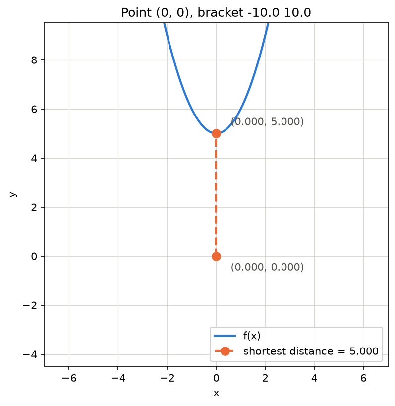

*Point $$(0,0)$$ — closest point $$(0.0000,\ 5.0000)$$, $$d=5.0000$$.*

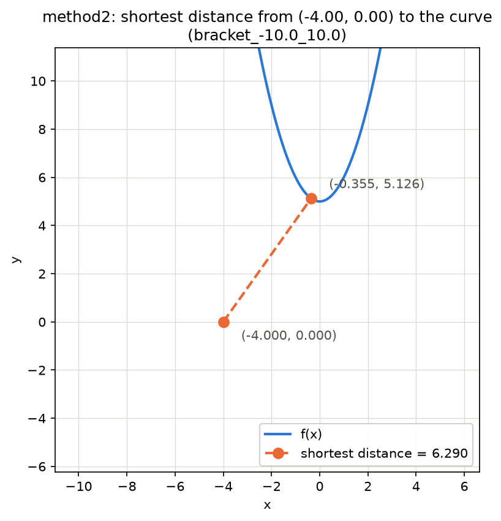

*Point $$(-4,0)$$ — closest point $$(-0.3555,\ 5.1264)$$, $$d=6.2898$$.*

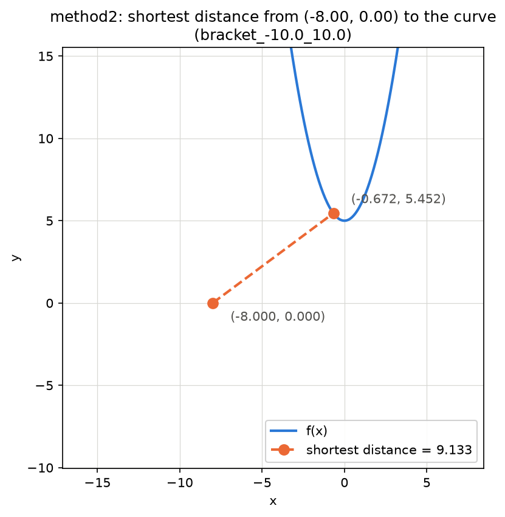

*Point $$(-8,0)$$ — closest point $$(-0.6721,\ 5.4517)$$, $$d=9.1334$$.*

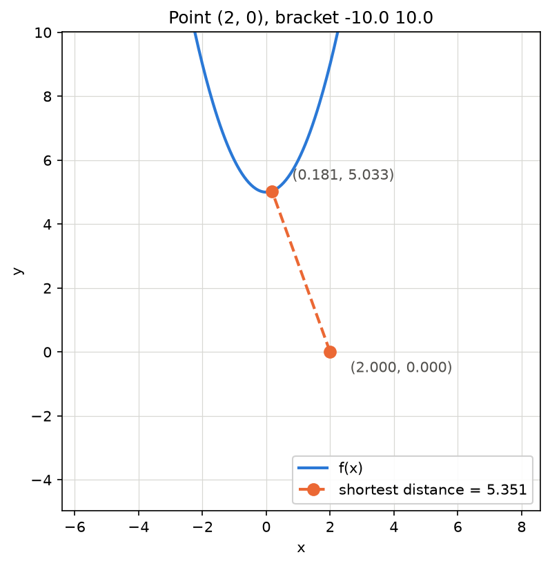

*Point $$(2,0)$$ — closest point $$(0.1807,\ 5.0327)$$, $$d=5.3514$$.*

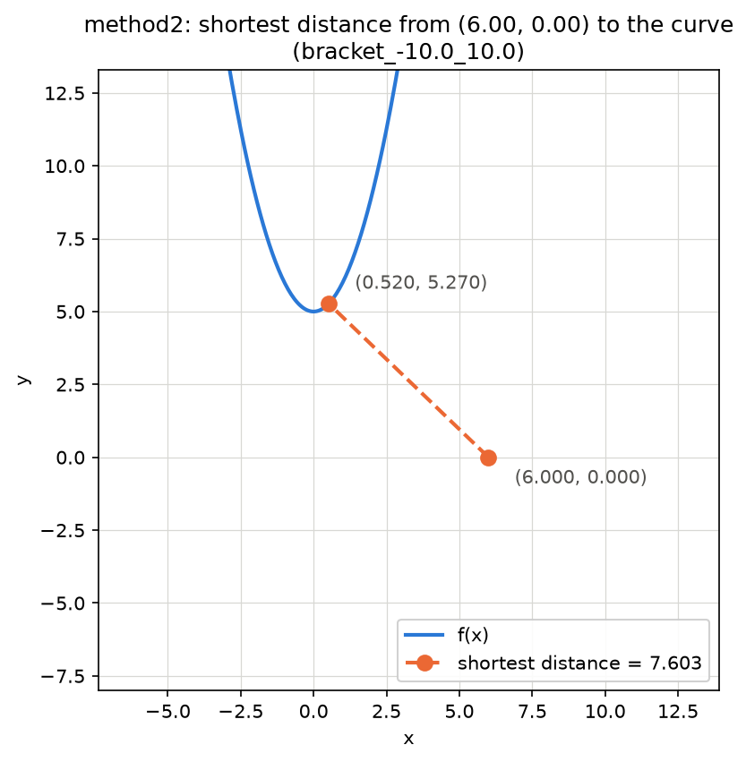

*Point $$(6,0)$$ — closest point $$(0.5199,\ 5.2703)$$, $$d=7.6031$$.*

The complete implementation is listed below, and is also available on
[GitHub](https://github.com/billylin609/billylin609.github.io/blob/main/SYDE572/assignment1/part2.py).

```python
import numpy as np

def golden_bisection(x0, y0, f, a, b, tolerance=1e-7):
  phi = (1 + np.sqrt(5))/2
  resphi = 2 - phi
  x1 = update_x1(a, b, resphi)
  x2 = update_x2(a, b, resphi)
  dist_x1 = objective_fn(x1, x0, f(x1), y0)
  dist_x2 = objective_fn(x2, x0, f(x2), y0)
  i = 0
  print(f'{"epoch":>5} {"a":>10} {"b":>10} {"x1":>10} {"x2":>10} '
        f'{"D(x1)":>12} {"D(x2)":>12}')
  while abs(b-a) > tolerance:
    i += 1
    if dist_x1 < dist_x2:
      b = x2
      x2 = x1
      dist_x2 = dist_x1
      x1 = update_x1(a, b, resphi)
      dist_x1 = objective_fn(x1, x0, f(x1), y0)
    else:
      a = x1
      x1 = x2
      dist_x1 = dist_x2
      x2 = update_x2(a, b, resphi)
      dist_x2 = objective_fn(x2, x0, f(x2), y0)
    print(f'{i:>5d} {a:>10.4f} {b:>10.4f} {x1:>10.4f} {x2:>10.4f} '
          f'{dist_x1:>12.4f} {dist_x2:>12.4f}')
  return (a+b)/2

def objective_fn(x, x0, f, y0):
  return (x-x0)**2+(f-y0)**2

def distance(x, x0, f, y0):
  return np.sqrt((x-x0)**2+(f-y0)**2)

def update_x1(a, b, resphi):
  return a + resphi * (b-a)

def update_x2(a, b, resphi):
  return b - resphi * (b-a)

f = lambda x: x**2+5

points = ((0, 0), (-4, 0), (-8, 0), (2, 0), (6, 0))
brackets = ((-10, 10), (-10, 10), (-10, 10), (-10, 10), (-10, 10))

for (x0, y0), (a, b) in zip(points, brackets):
  print(f'\n\n Points: ({x0}, {y0}), Bracket: [{a}, {b}]')
  best_x = golden_bisection(x0=x0, y0=y0, f=f, a=a, b=b)
  print(f'Summary: Best x: {best_x:.4f}, '
        f'Distance: {distance(best_x, x0, f(best_x), y0):.4f}')
```

### Discussion

The current methods are not able to find the shortest distance when
there are multiple real solutions and the initial guess is poor.

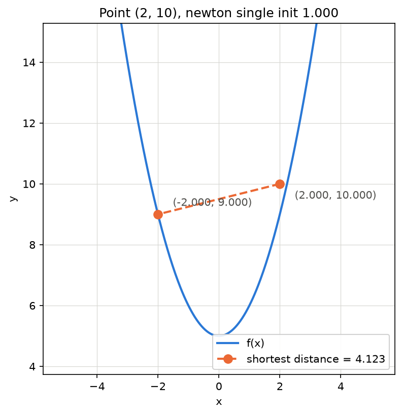

*From $$(2, 10)$$ with an initial guess of $$x=1$$, Newton-Raphson
returns $$x=-2$$ at a distance of $$4.123$$, when the true nearest
point is at $$x=2.225$$ and a distance of only $$0.230$$.*

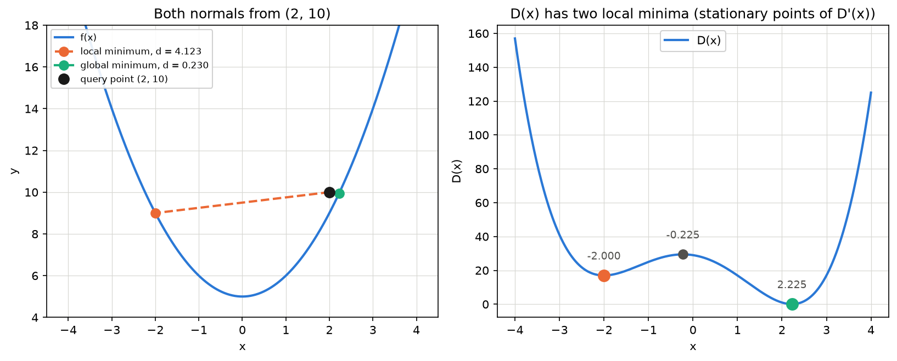

*$$D(x)$$ has two local minima, so the method converges to whichever
one its initial guess falls nearest. Running it from several starting
points and keeping the nearest result recovers the true minimum.*

The new algorithm was tested on two further points and works.

| Point $$(x_0, y_0)$$ | $$x^*$$ | Distance $$d$$ |
| :--- | ---: | ---: |
| $$(3, 16)$$ | $$3.3096$$ | $$0.3131$$ |
| $$(-4, 25)$$ | $$-4.4663$$ | $$0.4692$$ |

Nothing in the method is specific to a polynomial — only $$f$$, $$f'$$
and $$f''$$ are required. The same algorithm was run on an exponential,
a logarithmic and a radical curve, and every result matches a
brute-force search over the domain.

| Curve | Point $$(x_0, y_0)$$ | Domain | $$x^*$$ | Distance $$d$$ |
| :--- | :--- | :--- | ---: | ---: |
| $$f(x) = e^x$$ | $$(1, 0)$$ | $$[-4, 2]$$ | $$0.0000$$ | $$1.4142$$ |
| $$f(x) = \ln x$$ | $$(1, 3)$$ | $$[0.05, 6]$$ | $$2.0858$$ | $$2.5117$$ |
| $$f(x) = \sqrt{x}$$ | $$(5, 0)$$ | $$[0.01, 8]$$ | $$4.5000$$ | $$2.1794$$ |

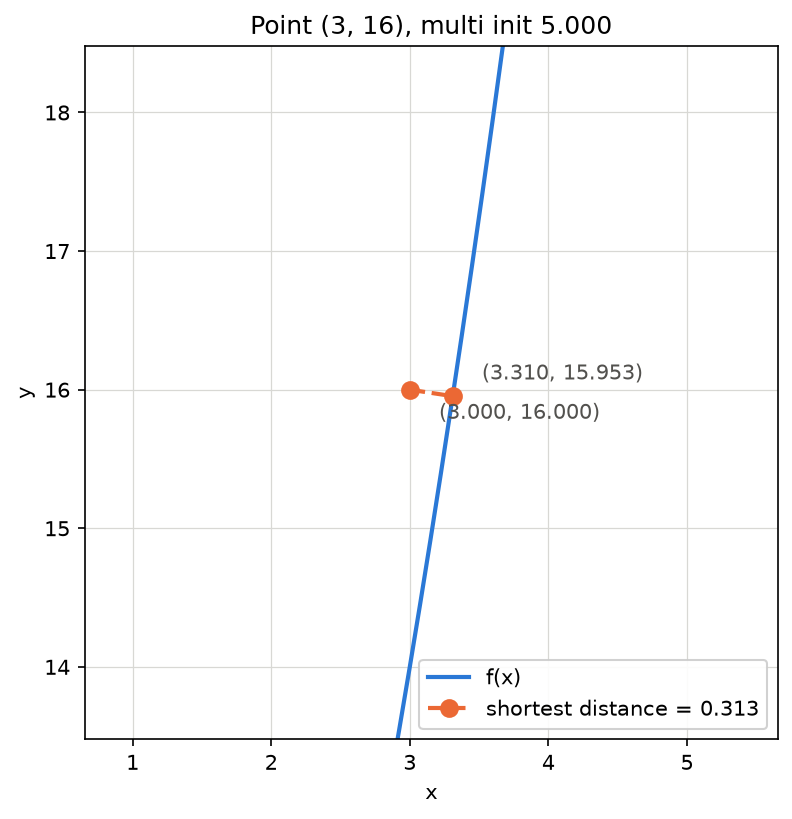

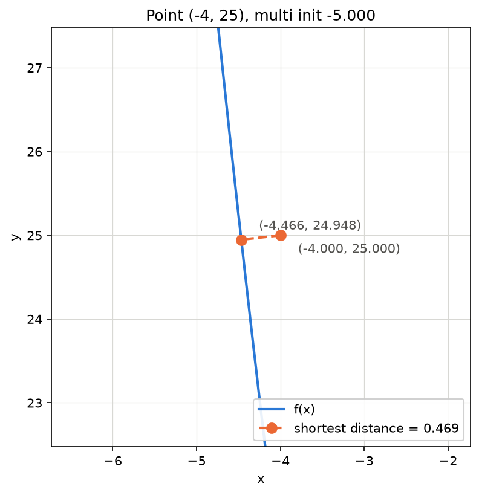

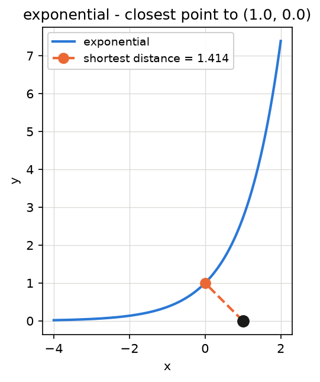

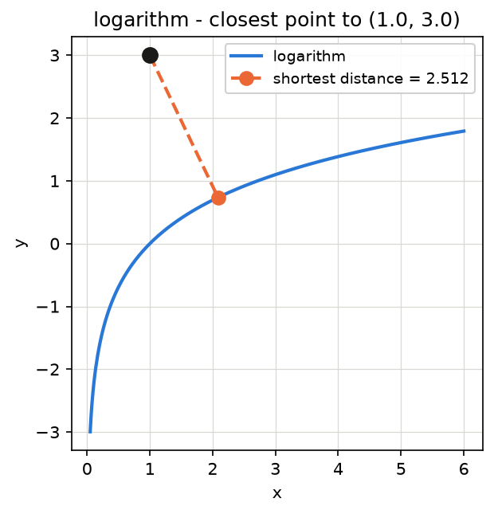

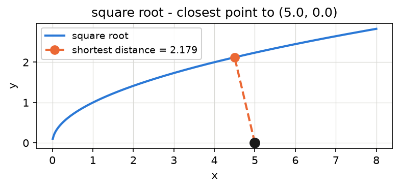

The intermediate steps below show the first four Newton iterations on
each curve, numbered from the initial guess and shaded light to dark.

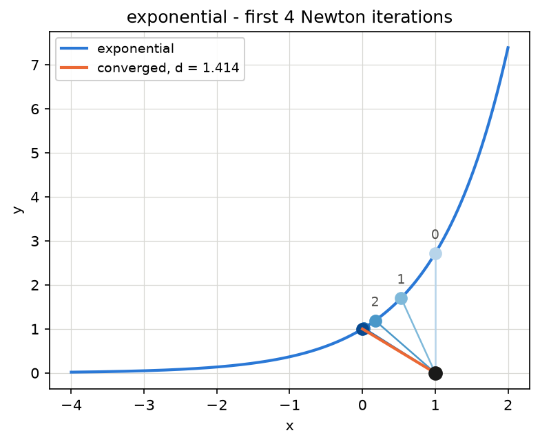

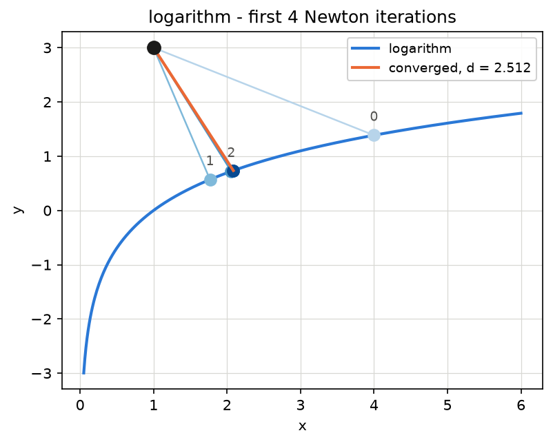

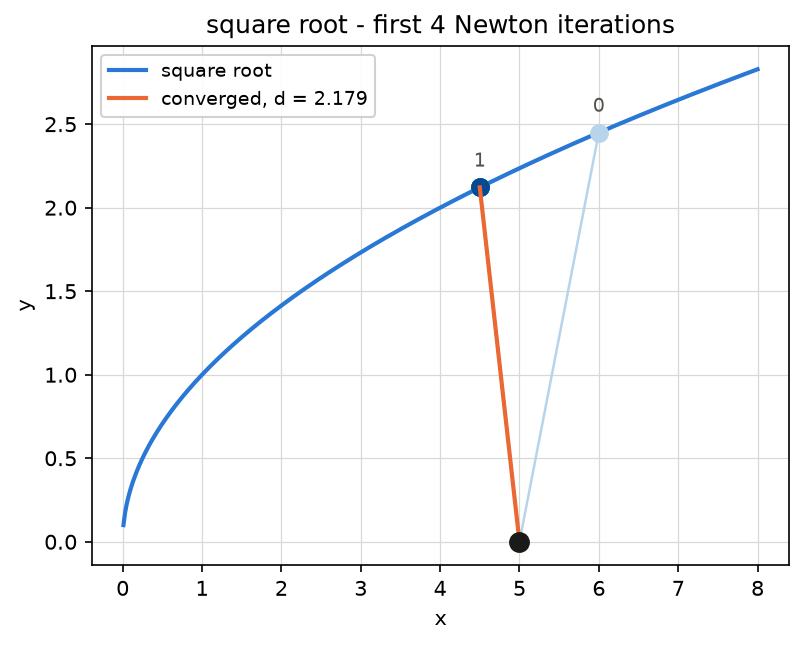

Intermediate steps of the two methods.

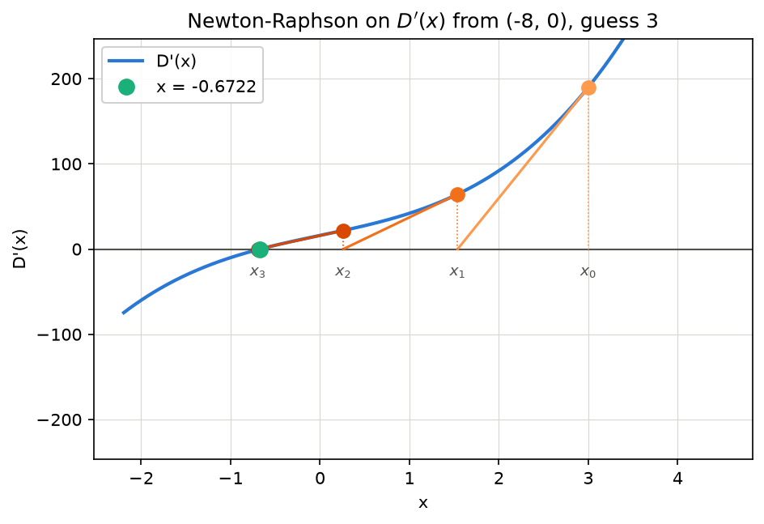

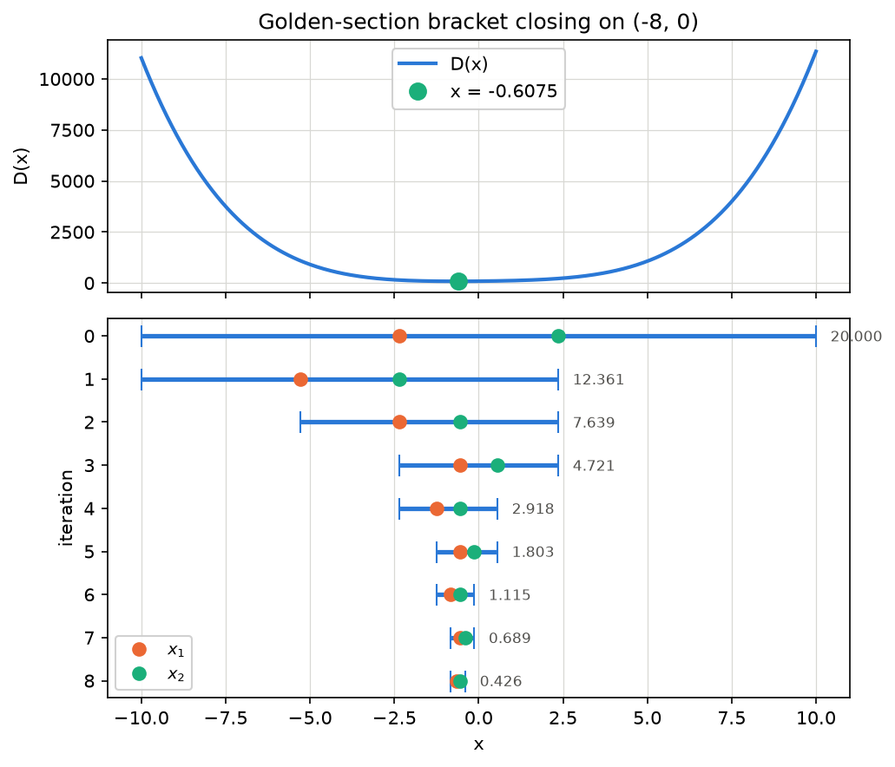


## Part 2:

### Method 1 (Analytic Solution):

Given points: $(0,0.5)$, $(2,3.5)$, $(1,1.5)$, and $(3,7.5)$.

**Line Fitting**

Start with line fitting and linear function is given $y=mx+b$

Represent the system in matrix form(over-constraint):

$$
A = 
\begin{bmatrix}
  x_1 & 1 \\
  x_2 & 1 \\
  x_3 & 1 \\
  x_4 & 1
\end{bmatrix}
$$

$$
x = \begin{bmatrix}
  m \\
  b
\end{bmatrix}
$$

$$
b =
\begin{bmatrix}
  y_1 \\
  y_2 \\
  y_3 \\
  y_4
\end{bmatrix}
$$

The linear system can be represented as $Ax=b$,
using pseudo inverse we are able to compute the
optimal solution in the system.

Pseudo inverse are defined as:

$$
x^{*} = (A^T \times A)^{-1} \times A^T \times b
$$

Solve it parts by parts:

$$
\begin{align}
A^T \times A &=
\begin{bmatrix}
  0 & 2 & 1 & 3 \\
  1 & 1 & 1 & 1 \\
\end{bmatrix}
\times 
\begin{bmatrix}
  0 & 1 \\
  2 & 1 \\
  1 & 1 \\
  3 & 1
\end{bmatrix} \\
&=
\begin{bmatrix}
  14 & 6 \\
  6 & 4 
\end{bmatrix}
\end{align}
$$

$$
\begin{align}
  (A^T \times A)^{-1} &= \frac{1}{det{(A^T \times A)}}
  \begin{bmatrix}
    d & -b \\
    -c & a
  \end{bmatrix}
  &= 
  \begin{bmatrix}
    0.2 & -0.3 \\
    -0.3 & 0.7
  \end{bmatrix}
\end{align}
$$

$$
\begin{align}
  (A^T \times A)^{-1} \times A^T \times b &=
  \begin{bmatrix}
    0.2 & -0.3 \\
    -0.3 & 0.7
  \end{bmatrix} \times
  \begin{bmatrix}
    0 & 2 & 1 & 3 \\
    1 & 1 & 1 & 1
  \end{bmatrix} \times
  \begin{bmatrix}
    0.5 \\
    3.5 \\
    1.5 \\
    7.5
  \end{bmatrix} \\
  &=
  \begin{bmatrix}
    2.3 \\
    -0.2
  \end{bmatrix}
\end{align}
$$

Therefore the line of best fit is $f(x) = 2.3x - 0.2$ with $MSE=0.575$.

**Parabola Fitting**

The function can be written as $f(x) = a^2 + bx + c$

The system can represented as the following matrix:

$$
A = 
\begin{bmatrix}
  x_1^2 & x_1 & 1 \\
  x_2^2 & x_2 & 1 \\
  x_3^2 & x_3 & 1 \\
  x_4^2 & x_4 & 1
\end{bmatrix}
$$

$$
x = \begin{bmatrix}
  a \\
  b \\
  c
\end{bmatrix}
$$

$$
b =
\begin{bmatrix}
  y_1 \\
  y_2 \\
  y_3 \\
  y_4
\end{bmatrix}
$$

The linear system can be represented as $Ax=b$,
using pseudo inverse we are able to compute the
optimal solution in the system.

Pseudo inverse are defined as:

$$
x^{*} = (A^T \times A)^{-1} \times A^T \times b
$$

Solve it parts by parts:

$$
\begin{align}
A^T \times A &=
\begin{bmatrix}
  0 & 4 & 1 & 9 \\
  0 & 2 & 1 & 3 \\
  1 & 1 & 1 & 1 \\
\end{bmatrix}
\times 
\begin{bmatrix}
  0 & 0 & 1 \\
  4 & 2 & 1 \\
  1 & 1 & 1 \\
  9 & 3 & 1
\end{bmatrix} \\
&=
\begin{bmatrix}
  98 & 36 & 14 \\
  36 & 14 & 6 \\
  14 & 6 & 4 
\end{bmatrix}
\end{align}
$$

$$
\begin{align}
  (A^T \times A)^{-1} = 
  \begin{bmatrix}
    0.25 & -0.75 & 0.25 \\
    -0.75 & 2.45 & -1.05 \\
    0.25 & -1.05 & 0.95
  \end{bmatrix}
\end{align}
$$

$$
\begin{align}
  (A^T \times A)^{-1} \times A^T \times b &=
  \begin{bmatrix}
    0.25 & -0.75 & 0.25 \\
    -0.75 & 2.45 & -1.05 \\
    0.25 & -1.05 & 0.95
  \end{bmatrix} \times
  \begin{bmatrix}
    0 & 4 & 1 & 9 \\
    0 & 2 & 1 & 3 \\
    1 & 1 & 1 & 1 \\
  \end{bmatrix} \times
  \begin{bmatrix}
    0.5 \\
    3.5 \\
    1.5 \\
    7.5
  \end{bmatrix} \\
  &=
  \begin{bmatrix}
    0.75 \\
    0.05 \\
    0.55
  \end{bmatrix}
\end{align}
$$

Therefore the line of best fit is $f(x) = 0.75x^2 +0.05x + 0.55$ with $MSE=0.0125$.

### Method 2: Numerical Solution

The goal is to use the MSE function $Err = MSE = \frac{1}{n} \sum(f(x_i)-y_i)$.
Each step function for Newton-Raphson method can be summarized as
$x_{new}=x - \frac{\frac{\partial E}{\partial x}}{\frac{\partial^2 E}{\partial x^2}}$

**Linear Function**

Linear function can be expressed as $y=mx+b$. Fix one variable and compute the
first and second order of partial derivative.

Case 1(fix b):

$$
\begin{align}
  \frac{\partial E}{\partial m} &= \frac{2}{n} \sum(mx_i+b - y_i)\cdot x_i \\
      &= \frac{1}{2} (14m + 6b -31)
\end{align}
$$

Case 2(fix m):

$$
\begin{align}
  \frac{\partial E}{\partial b} &= \frac{2}{n} \sum(mx_i+b - y_i) \\
      &= \frac{1}{2} (6m + 4b - 13)
\end{align}
$$

The second order partial derivatives are constant, since $$E$$ is
quadratic in both coefficients:

$$
\begin{align}
  \frac{\partial^2 E}{\partial m^2} &= \frac{2}{n} \sum x_i^2 = 7 \\
  \frac{\partial^2 E}{\partial b^2} &= \frac{2}{n} \cdot n = 2
\end{align}
$$

Each step function are $m_{new}=m-\frac{14m+6b-31}{14}$ and
$b_{new} = b - \frac{6m+4b-13}{4}$.

Starting from $$(m, b) = (1, 1)$$ and substituting the updated $$m$$
into the $$b$$ step, the first two iterations give:

| Iteration | $$m$$ | $$b$$ | $$\left\|\Delta\right\|$$ | MSE |
| :--- | ---: | ---: | ---: | ---: |
| 0 (initial) | $$1.0000$$ | $$1.0000$$ | — | $$3.2500$$ |
| 1 | $$1.7857$$ | $$0.5714$$ | $$0.8950$$ | $$0.9056$$ |
| 2 | $$1.9694$$ | $$0.2959$$ | $$0.3311$$ | $$0.7116$$ |

Iterating to a tolerance of $$10^{-7}$$ converges after 36 iterations to

$$
y = 2.3000x - 0.2000, \qquad \text{MSE} = 0.5750 \tag{8}\label{eq:line_fit}
$$

which matches the analytical least-squares solution of Method 1.

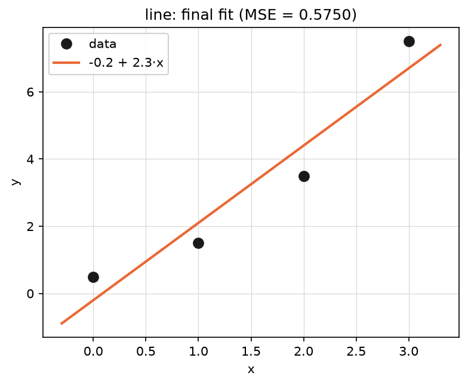

*The converged line against the four data points.*

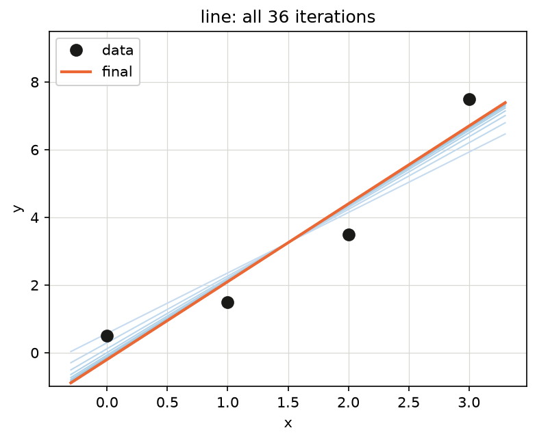

*Every iterate, shaded light to dark, collapsing onto the final fit.*

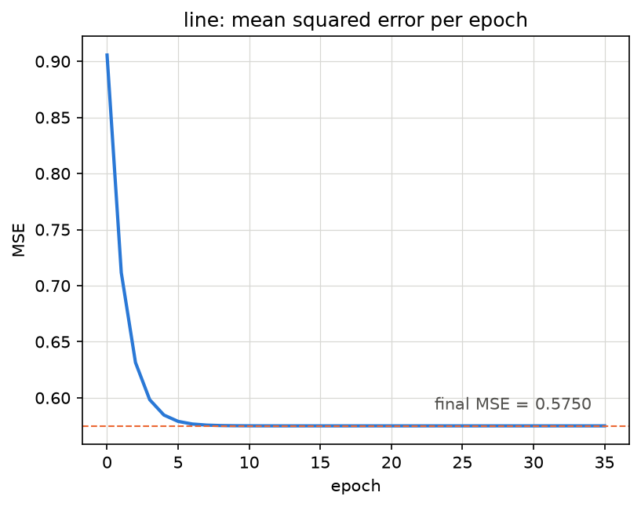

*Mean squared error per epoch, flattening at $$0.5750$$.*

**Parabola Function**

Parabola function can be expressed as $y=ax^2+bx+c$. Fix two variable and compute the first and second order of partial derivative.

With $$n=4$$ the required sums are $$\sum x_i = 6$$,
$$\sum x_i^2 = 14$$, $$\sum x_i^3 = 36$$, $$\sum x_i^4 = 98$$,
$$\sum y_i = 13$$, $$\sum x_i y_i = 31$$ and $$\sum x_i^2 y_i = 83$$.

Case 1 (fix $$b$$, $$c$$):

$$
\begin{align}
  \frac{\partial E}{\partial a} &= \frac{2}{n} \sum\left(ax_i^2+bx_i+c-y_i\right)x_i^2 \\
      &= \frac{1}{2}\left(98a + 36b + 14c - 83\right) 
\end{align}
$$

Case 2 (fix $$a$$, $$c$$):

$$
\begin{align}
  \frac{\partial E}{\partial b} &= \frac{2}{n} \sum\left(ax_i^2+bx_i+c-y_i\right)x_i \\
      &= \frac{1}{2}\left(36a + 14b + 6c - 31\right)
\end{align}
$$

Case 3 (fix $$a$$, $$b$$):

$$
\begin{align}
  \frac{\partial E}{\partial c} &= \frac{2}{n} \sum\left(ax_i^2+bx_i+c-y_i\right) \\
      &= \frac{1}{2}\left(14a + 6b + 4c - 13\right)
\end{align}
$$

The second order partial derivatives are constant, since $$E$$ is
quadratic in every coefficient:

$$
\begin{align}
  \frac{\partial^2 E}{\partial a^2} &= \frac{2}{n} \sum x_i^4 = 49 \\
  \frac{\partial^2 E}{\partial b^2} &= \frac{2}{n} \sum x_i^2 = 7 \\
  \frac{\partial^2 E}{\partial c^2} &= \frac{2}{n} \cdot n = 2 \tag{12}\label{eq:par_second}
\end{align}
$$

Each step function is therefore

$$
\begin{align}
  a_{new} &= a - \frac{98a + 36b + 14c - 83}{98} \\
  b_{new} &= b - \frac{36a + 14b + 6c - 31}{14} \\
  c_{new} &= c - \frac{14a + 6b + 4c - 13}{4}
\end{align}
$$

Starting from $$(a, b, c) = (1, 1, 1)$$ and substituting each updated
coefficient into the next step, the first two iterations give:

| Iteration | $$a$$ | $$b$$ | $$c$$ | $$\left\|\Delta\right\|$$ | MSE |
| :--- | ---: | ---: | ---: | ---: | ---: |
| 0 (initial) | $$1.0000$$ | $$1.0000$$ | $$1.0000$$ | — | $$11.2500$$ |
| 1 | $$0.3367$$ | $$0.9198$$ | $$0.6917$$ | $$0.7358$$ | $$0.3544$$ |
| 2 | $$0.4102$$ | $$0.8630$$ | $$0.5197$$ | $$0.1955$$ | $$0.1812$$ |

Iterating to a tolerance of $$10^{-7}$$ converges after 368 iterations to

$$
y = 0.7500x^2 + 0.0500x + 0.5500, \qquad \text{MSE} = 0.0125
\tag{13}\label{eq:parabola_fit}
$$

The quadratic reduces the error by a factor of 46 against the linear fit
of eq. $$\eqref{eq:line_fit}$$, but takes an order of magnitude more
iterations to converge.

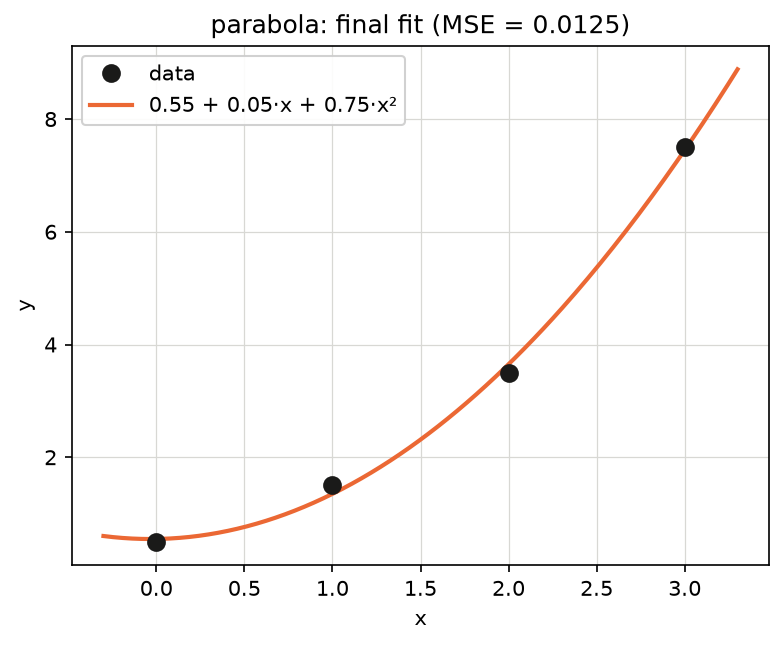

*The converged parabola against the four data points.*

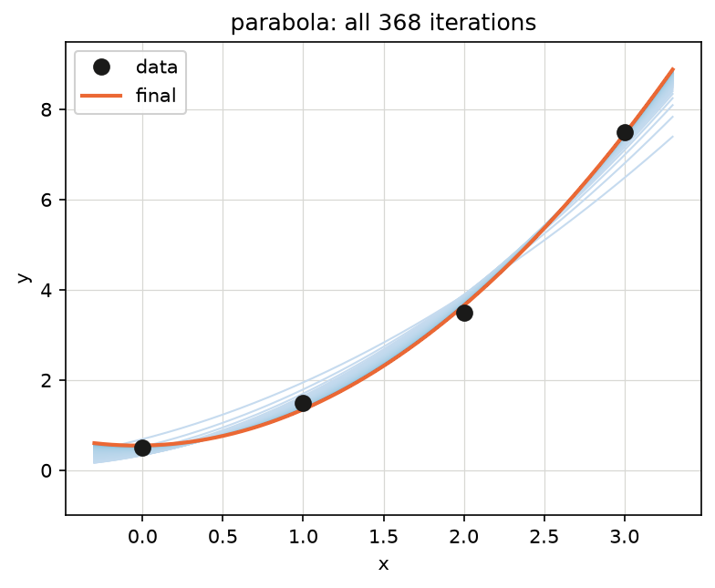

*Every iterate, shaded light to dark, collapsing onto the final fit.*

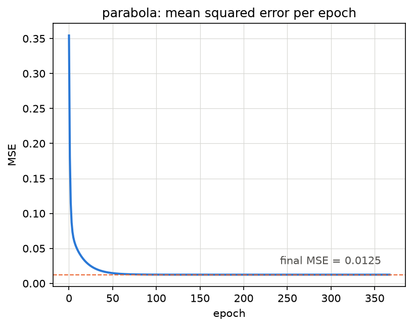

*Mean squared error per epoch, flattening at $$0.0125$$.*

The complete implementation is listed below, and is also available on
[GitHub](https://github.com/billylin609/billylin609.github.io/blob/main/SYDE572/assignment1/part4.py).

```python
import numpy as np
import matplotlib.pyplot as plt
from numpy.polynomial import Polynomial
from pathlib import Path

def line_fitting(x, y, initial_guess, dm, ddm, db, ddb, tolerance=1e-7, max_iter=1000):
  m, b = initial_guess
  history, mses = [], []
  for i in range(max_iter):
    m_new = m - dm(m, b)/ddm(m, b)
    b_new = b - db(m_new, b)/ddb(m_new, b)
    step = np.linalg.norm([m_new - m, b_new - b])
    mse = np.mean((m_new*x + b_new - y)**2)
    history.append(np.array([b_new, m_new]))
    mses.append(mse)
    if i <= 2:
      print(f'epoch: {i}, m: {m_new:.6f}, b: {b_new:.6f}, '
            f'norm: {step:.3e}, MSE: {mse:.6f}')
    m = m_new
    b = b_new
    if step < tolerance:
      break
  print(f'Result: y = {m:.4f}x + {b:.4f}, '
        f'MSE = {np.mean((m*x + b - y)**2):.6f}')
  return m, b, history, mses

def parabola_fitting(x, y, initial_guess, da, dda, db, ddb, dc, ddc,
    tolerance=1e-7, max_iter=1000):
  a, b, c = initial_guess
  history, mses = [], []
  for i in range(max_iter):
    a_new = a - da(a, b, c)/dda(a, b, c)
    b_new = b - db(a_new, b, c)/ddb(a_new, b, c)
    c_new = c - dc(a_new, b_new, c)/ddc(a_new, b_new, c)
    step = np.linalg.norm([a_new - a, b_new - b, c_new - c])
    mse = np.mean((a_new*x**2 + b_new*x + c_new - y)**2)
    history.append(np.array([c_new, b_new, a_new]))
    mses.append(mse)
    if i <= 2:
      print(f'epoch: {i}, a: {a_new:.6f}, b: {b_new:.6f}, c: {c_new:.6f}, '
            f'norm: {step:.3e}, MSE: {mse:.6f}')
    a = a_new
    b = b_new
    c = c_new
    if step < tolerance:
      break
  print(f'Result: y = {a:.4f}x^2 + {b:.4f}x + {c:.4f}, '
        f'MSE = {np.mean((a*x**2 + b*x + c - y)**2):.6f}')
  return a, b, c, history, mses

x_0 = np.array([0., 2., 1., 3.])
y_0 = np.array([0.5, 3.5, 1.5, 7.5])

initial_guess = (1., 1.)

# D(m, b) = sum (m*x + b - y)^2, differentiated once and twice in each
# parameter separately
residual = lambda m, b: m*x_0 + b - y_0
dm  = lambda m, b: 2 * np.sum(x_0 * residual(m, b))
ddm = lambda m, b: 2 * np.sum(x_0**2)
db  = lambda m, b: 2 * np.sum(residual(m, b))
ddb = lambda m, b: 2 * len(x_0)

m, b, line_hist, line_mses = line_fitting(
    x_0, y_0, initial_guess, dm, ddm, db, ddb)

# D(a, b, c) = sum (a*x^2 + b*x + c - y)^2, same coordinate-wise scheme
parabola_initial_guess = (1., 1., 1.)
parabola_residual = lambda a, b, c: a*x_0**2 + b*x_0 + c - y_0
da  = lambda a, b, c: 2 * np.sum(x_0**2 * parabola_residual(a, b, c))
dda = lambda a, b, c: 2 * np.sum(x_0**4)
db2 = lambda a, b, c: 2 * np.sum(x_0 * parabola_residual(a, b, c))
ddb2 = lambda a, b, c: 2 * np.sum(x_0**2)
dc  = lambda a, b, c: 2 * np.sum(parabola_residual(a, b, c))
ddc = lambda a, b, c: 2 * len(x_0)

a, b, c, par_hist, par_mses = parabola_fitting(
    x_0, y_0, parabola_initial_guess, da, dda, db2, ddb2, dc, ddc)
```


## Appendix A: Hand Calculations

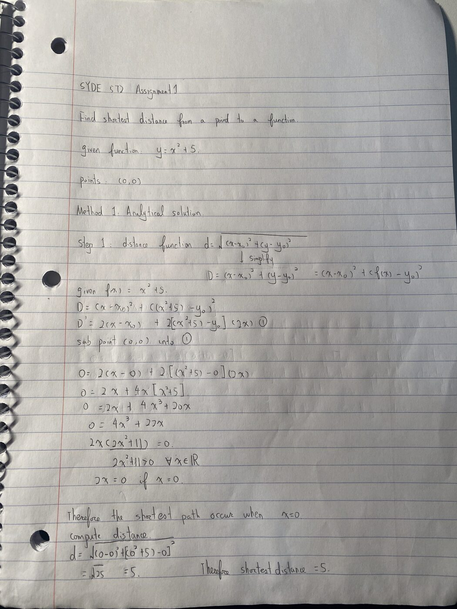

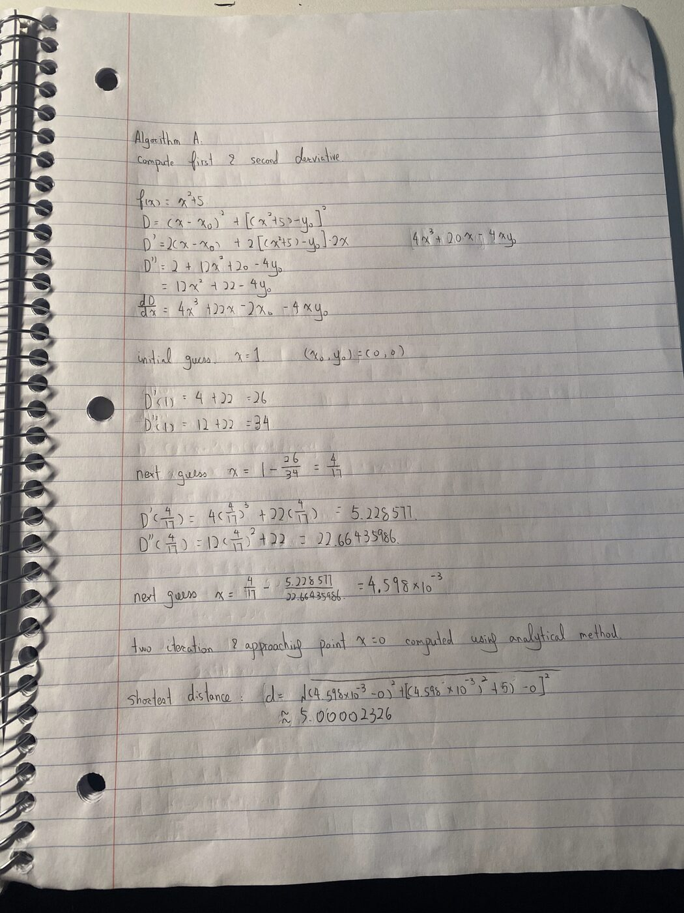

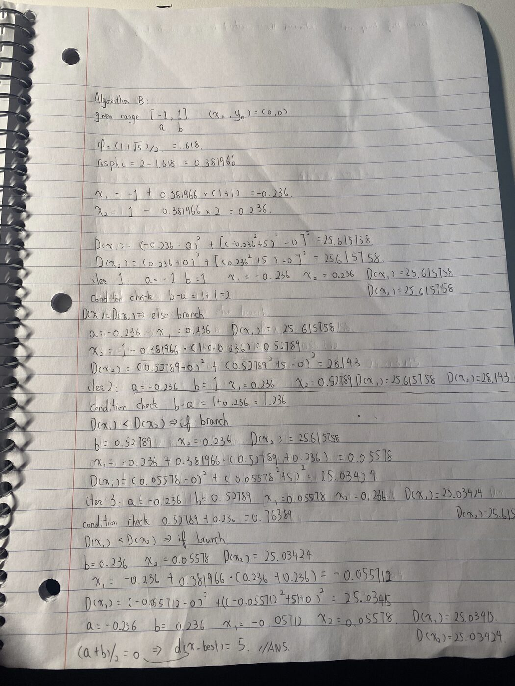

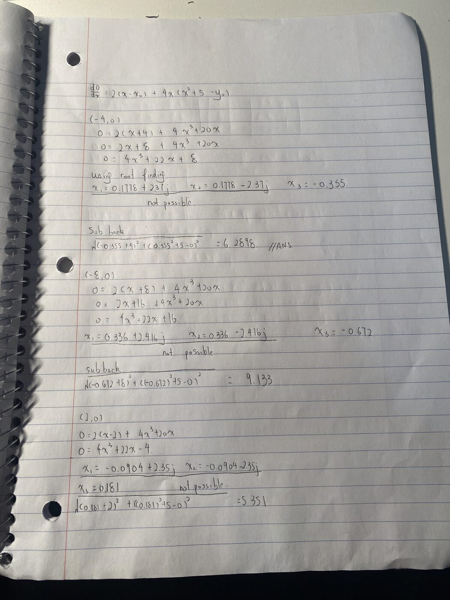

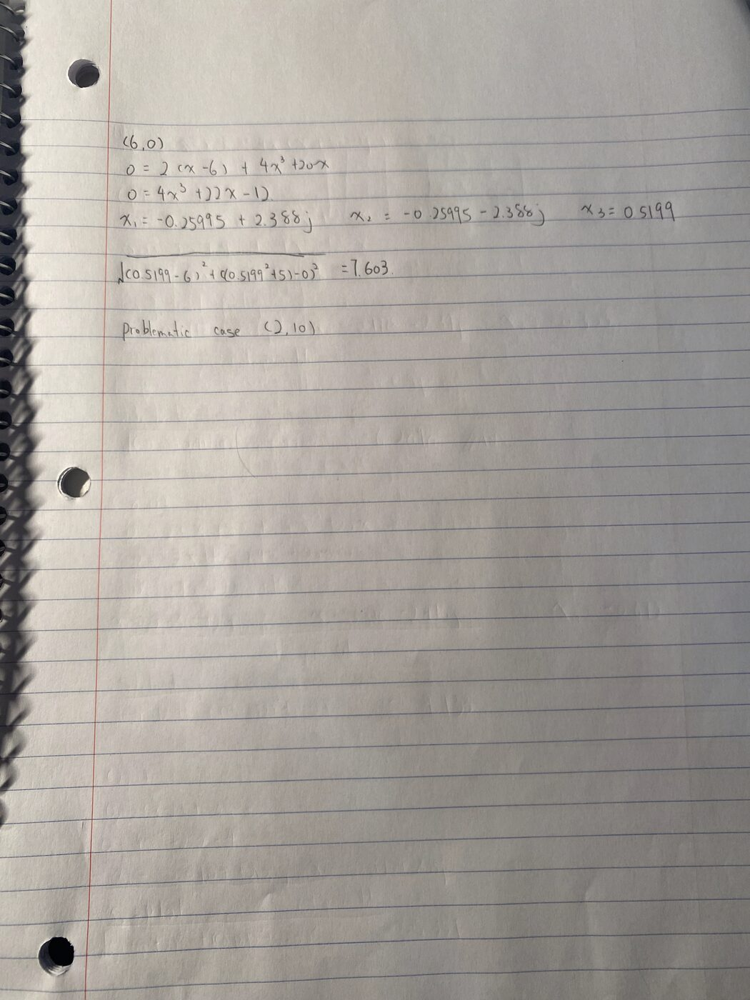

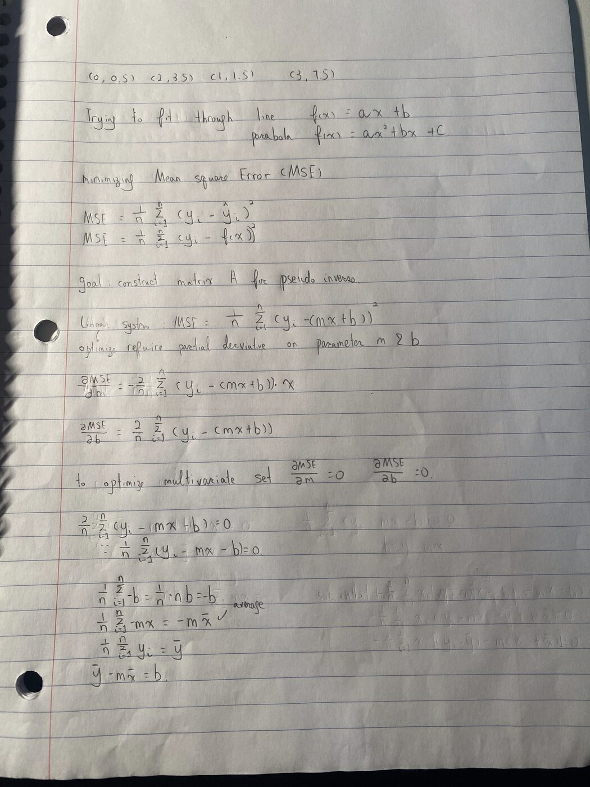

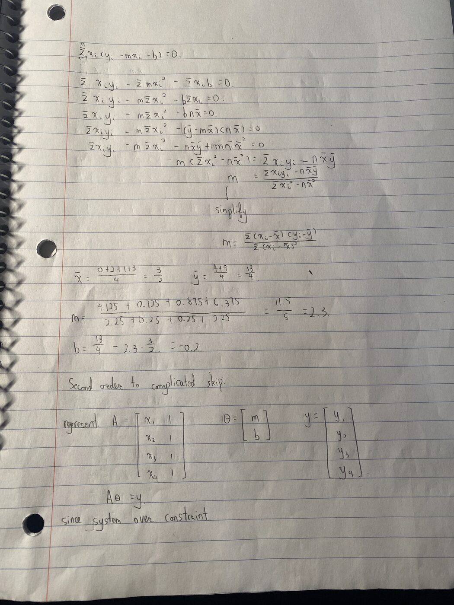

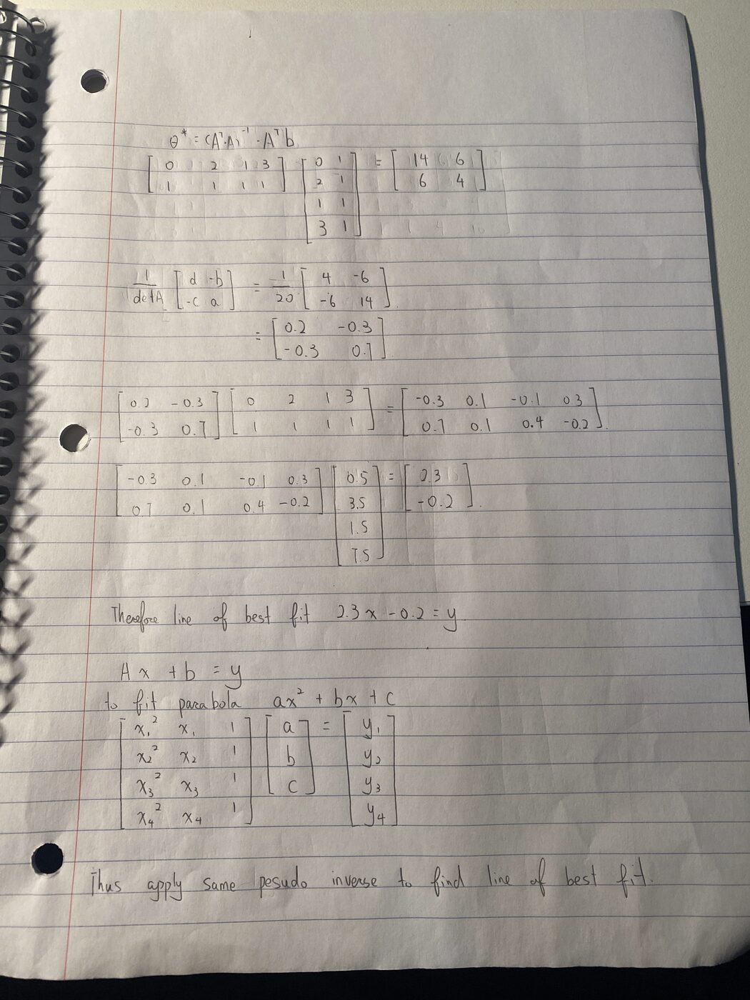

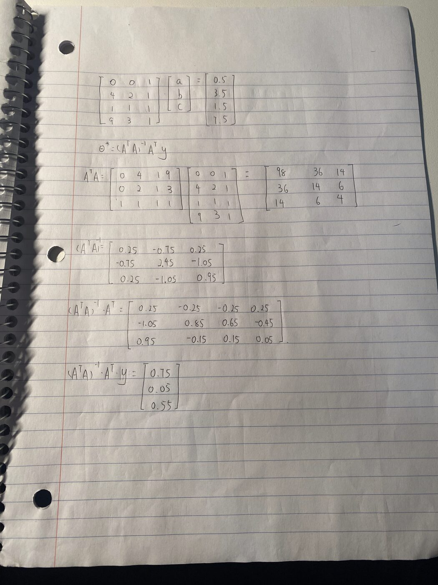

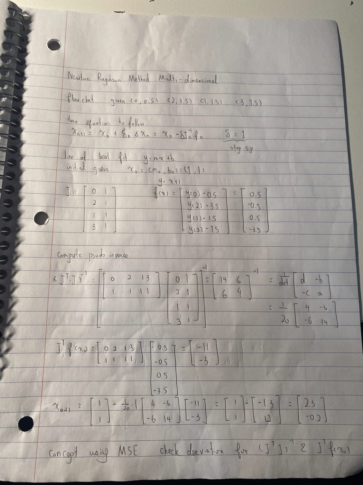

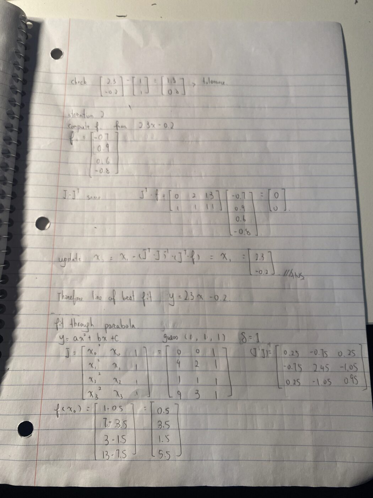

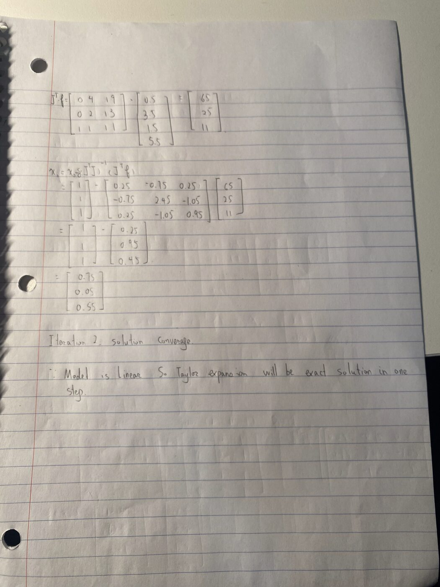

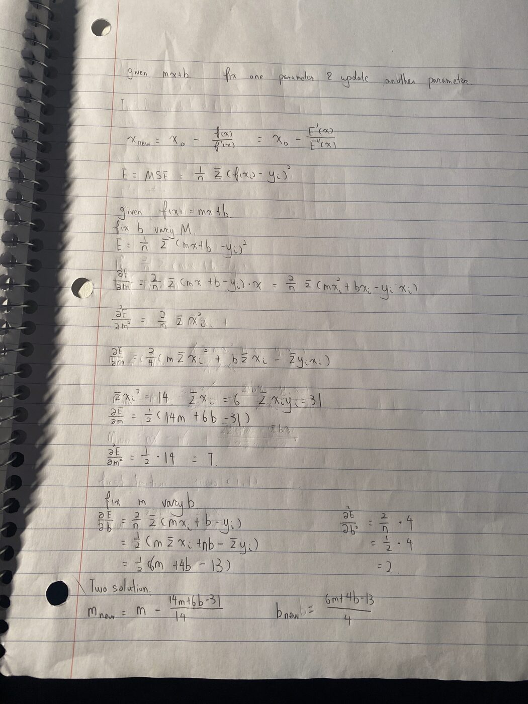

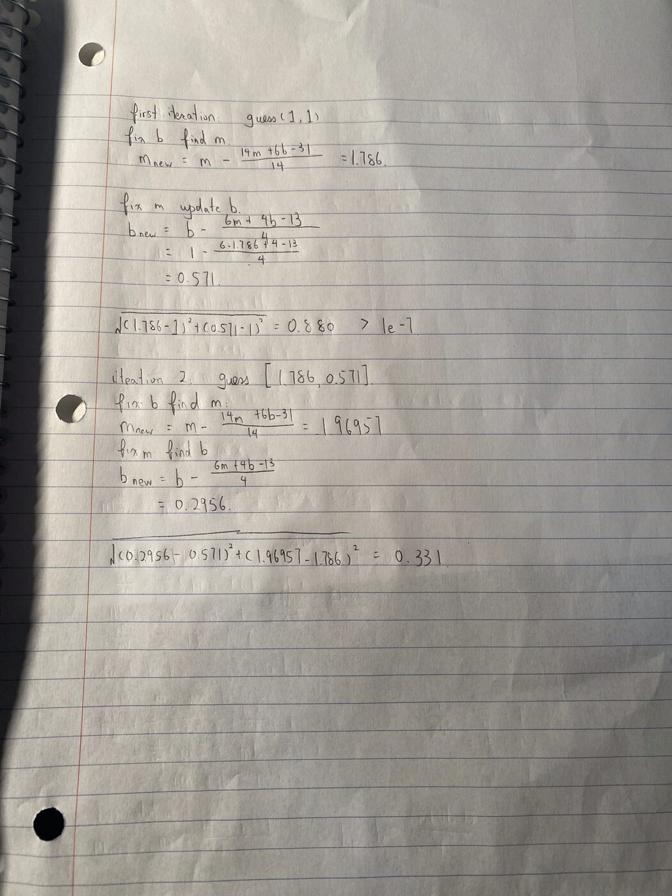
